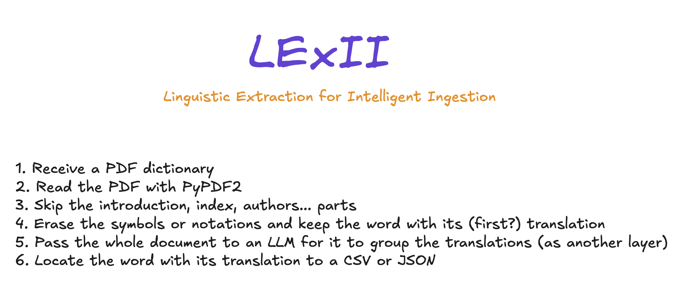

# Linguistic Extraction for Intelligent Ingestion (LExII)

Scraping bilingual dictionaries using LLMs

## 🧠 Flow Process 


>[!NOTE]
> Check the json inside `jsons` folder as an example of the final result.

## 🔧 Configuration
In my case I use Azure OpenAI's GPT4-o model, so I need a .env file where I place the credentials.
```
AZURE_API_KEY=
AZURE_API_VERSION=
AZURE_ENDPOINT=
AZURE_DEPLOYMENT=
```

After that, install all the requirements:
```sh
pip install -r requirements.txt
```

>[!IMPORTANT]
> I really recommend to use GPT4-o. I tried the same process with LLAMA-3.2 and 3.3 and the results weren't good

## 🧑‍💻 Running
1. Upload your PDF dictionary file into a folder inside the project root
2. Change the path and the pages in ln. 47 of `app.py` for your needs
3. Run the program
```sh
python app.py
```

4. Check the JSON file in the `jsons` folder if something failed or if something needs to be corrected. 